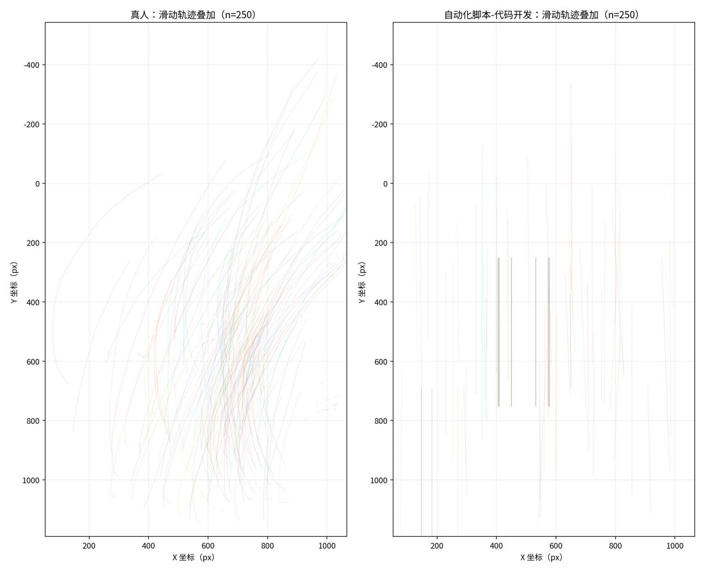
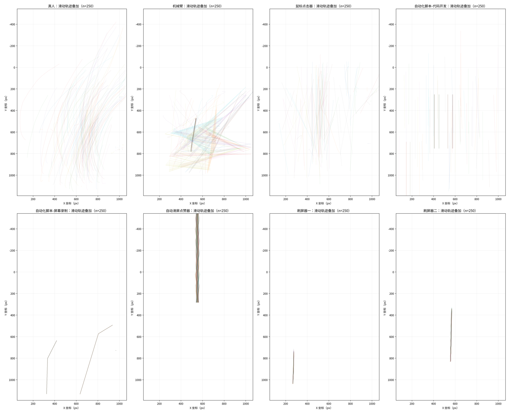
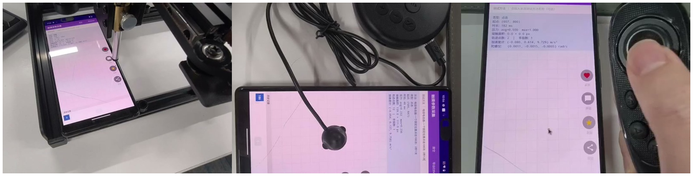
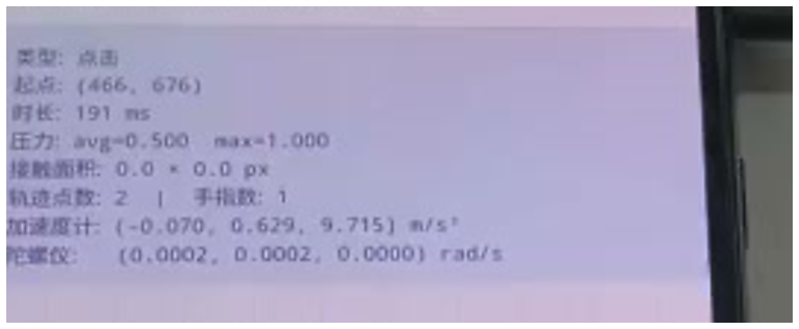

# gesture-fingerprint

**English** · [中文](./README.md)

Given touch telemetry from a mobile app, decide whether a tap or swipe came from
**a human hand, a software script, or a specific piece of cheating hardware**.

Not just bot detection — it tells you **which kind** of machine.



> The same gesture, repeated **250 times**, with all trajectories overlaid.
> Left is a human, right is an automation script — **no algorithm needed, the
> difference is visible to the naked eye.**
>
> What this project does is break that difference into 9 quantifiable dimensions,
> so a program can decide not only "not human", but "which machine".

> **Note on language.** The charts are labelled in Chinese, and the detailed
> experiment write-ups under [`docs/`](./docs) are Chinese-only for now.
> This page covers everything you need to run and evaluate the tool.
> Translations are welcome — see [Contributing](#contributing).

---

## What the output looks like

**Input**: touch telemetry CSV
**Output**:

```
# Gesture classification report

- Total gestures: 50
- Predicted classes: 1

## Prediction distribution

| Class                        | Count | Share   |
|------------------------------|-------|---------|
| automation script (recorded) | 50    | 100.00% |

## Group-level verdict

| Group              | N  | Min N | Status    | Verdict                      | Majority |
|--------------------|----|-------|-----------|------------------------------|----------|
| gesture_type=SWIPE | 50 | 30    | conclusive| automation script (recorded) | 100.00%  |
```

> Reproduce it yourself: `example_outputs/` **is** this run. The input is
> `人工测试数据/touch_20260724_194625*` in this repo.

Every verdict carries its evidence — it is not an opaque score:

| Actual device | Verdict | Evidence |
|---|---|---|
| Robotic arm | Robotic arm | Non-zero contact area → physical-touch branch; medium contact area, low pressure, high speed variability — consistent with a robotic arm |
| Human | Human | Non-zero contact area; large contact area, natural pressure with real variation; swipe speed high and speed variability within the natural range |
| Screen-recording script | Automation script (recorded) | Contact area ≈ 0 and mean pressure ≈ 1 — injected / non-physical touch; per-point pressure variability ≈ 0; path redundancy in the recorded-playback range |

The underlying feature values:

| Actual device | Contact area (px²) | Mean pressure | Speed variability |
|---|---:|---:|---:|
| Human | 21252 | 0.419 | 0.669 |
| Robotic arm | 8057 | 0.155 | 0.617 |
| Screen-recording script | 0 | 1.000 | 0.002 |
| Mouse clicker | 0 | 0.941 | 0.354 |

---

## The 10 classes

| | |
|---|---|
| **Human** | baseline |
| **Software** | hand-written script · screen-recording playback · HID |
| **Hardware** | capacitive clicker · mouse clicker · robotic arm · auto-swipe/liker · screen-swiper A · screen-swiper B |

**Every tool leaves a different trajectory signature** — which is why identifying
*which* machine is possible at all:



Left to right, top to bottom: human, robotic arm, mouse clicker, hand-written
script, screen-recording playback, auto-swipe/liker, screen-swiper A,
screen-swiper B. All 250 swipes each —

- **Human** fans out; every start and end point differs, with natural curvature
- **Robotic arm** comes closest to human, but is visibly tighter and more structured (it is the hardest class to separate)
- **Hand-written script** is a set of perfectly straight vertical lines, pinned to a few fixed X coordinates
- **Screen-recording playback** collapses to two polylines — 250 gestures replaying the same recording
- **Screen-swipers** and the **auto-swipe/liker** shrink to a single narrow bundle; a physical motor only travels one path

---

## Where the rules come from

Everything below is measured, not assumed.



<sub>Frames from our test recordings. Left: a robotic arm reads the screen through
a camera and taps with a physical actuator. Middle: a capacitive clicker's silicone
tip sits directly on the glass. Right: a mouse clicker driving the phone over
Bluetooth HID.</sub>

We bought **8 classes of off-the-shelf cheating hardware** (¥1,863.6 total, from a
¥61.9 capacitive clicker to a ¥1,535 robotic arm) and built two software script
baselines. On 3 phones across different OS versions, a human and every tool
performed the same taps, swipes and long-presses — flat on a desk, upright in a
stand, handheld while seated, handheld while walking, and on a subway. Each
tool × scenario was repeated 300–500 times, with the collector logging a sample
every ~10 ms.

**75,386 labelled gestures in total.**

Then we compared them across 9 dimensions:

| Dimension | Discriminative power | Summary |
|---|---|---|
| Speed variability (swipe) | very high | Scripts ≈ 0; human ≈ 0.51; robotic arm ≈ 0.65; screen-swiper A highest at ≈ 1.09 |
| Contact area | very high | Software injection / HID / mouse clicker mostly 0; human largest; arm, swipers and capacitive clicker sit at non-zero mid-to-high values |
| Pressure | high | Scripts / HID / auto-liker are pinned at 1; human, arm, swipers and capacitive clicker occupy lower, mutually distinct bands |
| Pressure variability | high | Scripts / HID ≈ 0; human ≈ 0.23 |
| Mean swipe speed | medium-high | Auto-liker fastest, human next, mouse clicker slowest |
| Path redundancy | medium | Scripts are near-straight; a human actually travels ~4.8% farther than the straight line |
| Mean curvature | medium | Scripts and capacitive clicker ≈ 0; arm, human and swipers higher |
| Linear acceleration † | medium | Reflects whether the phone is genuinely being held and moved |
| Gyroscope † | medium | Same; near 0 when flat or in a stand |

> **†** These two need a *phone state* label (handheld / flat / walking) as
> context. When telemetry does not carry that field the engine runs on the other
> **7 dimensions** — which is the usual case in production. See
> [Known limits](#known-limits).

Pressure variability, one dimension of the nine, across all tool classes:


Human (n=19,354) forms a natural bell curve, P50 ≈ 0.23. Hand-written scripts,
screen-recording playback and the auto-liker land at **exactly 0 almost 100% of
the time** — every press is identical to the last. The mouse clicker piles up on
the oddly specific constant 1.4142.

**A machine's biggest tell isn't that it does the job badly — it's that it does
the job too perfectly.**

Charts for the other 8 dimensions: [`docs/02`](./docs/02-九维度分析.md) (Chinese).

---

## Quick start

```bash
python3 -m venv .venv && source .venv/bin/activate
pip install -e .

gesture-classify \
  --summary-csv     your_data.csv \
  --trajectory-csv  your_data_trajectory.csv \
  --output-dir      ./out
```

Pure Python standard library, **zero third-party dependencies**, Python ≥ 3.9.

Run without installing:

```bash
PYTHONPATH=src python3 -m gesture_behavior_classifier.cli \
  --summary-csv your_data.csv --trajectory-csv your_data_trajectory.csv --output-dir ./out
```

---

## Input data

Two CSVs:

**Gesture-level summary** (one row per gesture)
`gesture_index` `gesture_type` `start_x/y` `end_x/y` `duration_ms` `avg_pressure` `touch_major/minor` `avg_curvature` `linear_x/y/z` `gyro_x/y/z` …

**Trajectory points** (one row per sample — strongly recommended)
`gesture_index` `point_index` `x` `y` `pressure` `touch_major` `touch_minor` `vx_px_s` `vy_px_s` `curvature`

Pressure variability, contact area, speed variability and path redundancy all
depend on per-point data. Summary-only input loses most of the discriminative power.

The clearest way to see these fields is the collector's live readout. Below is a
single tap from a **mouse clicker**, as the phone recorded it:



Note **`接触面积: 0.0 × 0.0 px`** (*contact area: 0.0 × 0.0 px*) — it never touched
the glass at all; the event was injected over Bluetooth HID. That is the first and
most reliable split in the whole method: **whether physical contact actually
happened**, which cannot be faked.

As for `压力: avg=0.500` (*pressure*) in the same frame — that was the pattern we
saw in round one. Round two, with a different batch, measured 0.94 instead.
**That inconsistency went on to become our single largest source of
misclassification**, and it is the most concrete argument for per-device-model
calibration. See [`docs/04`](./docs/04-验证与局限.md).

> **No collector?** `人工测试数据/` in this repo holds the 5 raw blind-test sets.
> Clone it and you can reproduce the results below without installing anything.
>
> The Android collector we used is on the [Releases](../../releases) page, but
> **it is lab equipment and should not be installed on a daily-driver phone** —
> read [About the collector app](#about-the-collector-app) first.

---

## Output

| File | Contents |
|---|---|
| `识别报告.md` | Human-readable summary report |
| `分组正式判定.csv` | **The formal verdict** — batch decision once the minimum sample size is met |
| `手势识别结果.csv` | Per-gesture class, confidence, matched-rule evidence, per-class scores |
| `手势特征明细.csv` | All 9 computed features per gesture |
| `批次识别汇总.csv` | Prediction distribution by gesture type and phone state |

---

## Blind test

Five characteristic tools, each with a fresh capture that **took no part in rule
design**, classified blind. Sample sizes are small (50–66 per group); the table
below is raw counts, not a statistical accuracy estimate:

| Actual device | Correct / total | Main error |
|---|---:|---|
| Human — index finger | 50 / 50 | — |
| Screen-recording script | 50 / 50 | — |
| Human — thumb | 53 / 54 | 1 returned "unknown" |
| Mouse clicker | 39 / 50 | 11 misread as HID |
| Robotic arm | 48 / 66 | 18 returned "unknown" |

> ⚠️ **Do not read these as accuracy figures.** Each group holds only a few dozen
> samples; even a clean 50/50 has a confidence-interval lower bound around 93%.
> Change the device batch or the phone model and the numbers move. Their purpose
> is to **show where the errors are**, not to promise performance.

**No cross-category errors occurred** — a human was never called a machine, and a
machine was never called a human. Every error stayed inside one category or
degraded to "unknown". That is currently the most trustworthy property of the method.

We publish the weak rows too; the failure analysis is in
[`docs/04`](./docs/04-验证与局限.md). Bring your own data and open an issue or PR.

---

## Known limits

Please read this section first — it decides whether the project fits your case at all.

- **Not a real-time blocker.** A formal verdict needs ≥30 swipes or ≥50 taps;
  below that you only get advisory values. It produces an **account- or
  session-level classification** and cannot stop a single request. It belongs
  behind your existing blocking pipeline, not in place of it.
- **Requires client-side instrumentation.** Pressure, contact area and per-point
  trajectories exist only inside the app. None of the required fields appear in
  gateway or server-side logs.
- **Thresholds need per-model calibration.** Contact-area and speed thresholds are
  absolute values tied to screen DPI, touch driver and ROM. The shipped values
  come from our lab devices; **calibration is the first step when onboarding a new
  phone model** — all thresholds live in one JSON file, so no code changes are needed.
- **Two sensor dimensions need context.** The linear-acceleration and gyroscope
  rules depend on a phone-state label; without it the engine runs on 7 dimensions.
- **A rule engine, not a trained model.** Every verdict is explainable, auditable
  and can go straight into a report; the cost is that it will not adapt to new
  devices on its own.
- **`confidence` is not a probability.** It is a monotone transform of the rule
  score, useful only for ranking within one batch — never read it as "99% sure".

---

## Typical uses

- **Baseline** — sample real traffic and find out how much of it is machine-driven, and by which tools
- **Labelling** — generate tool-typed negative samples for the risk model you already have, which addresses the usual shortage of labelled data
- **Triage** — tool cost is a proxy for how organised your adversary is: a ¥61.9 capacitive clicker and a ¥1,535 robotic arm are not the same league. What you do about it is your risk policy's call

---

## Tuning thresholds

Every threshold lives in
[`default_rules.json`](./src/gesture_behavior_classifier/config/default_rules.json).
Edit the JSON; no code changes required:

```bash
gesture-classify --config my_rules.json ...
```

Grouping and sample-size gates are configurable too:

```bash
# Default: group by gesture_type only (suits production data with no extra context)
gesture-classify --group-by gesture_type,phone_status ...

# More conservative sample requirement
gesture-classify --min-samples 100 ...
```

---

## Layout

```
src/gesture_behavior_classifier/
├── features.py              # compute the 9 features from raw CSV
├── rules.py                 # rule scoring and per-gesture verdict
├── aggregate.py             # batch aggregation and minimum-sample gate
├── report.py                # Markdown report generation
├── cli.py                   # command-line entry point
└── config/
    └── default_rules.json   # all thresholds
docs/                        # full experiment data and per-dimension analysis (Chinese)
example_outputs/             # a complete real run
人工测试数据/                 # 5 blind-test sets, reproduce the table above
tests/
```

---

## About the data

`人工测试数据/` contains **104 human gestures** (54 thumb swipes + 50 index-finger
swipes) alongside tool-generated controls. Regarding the human data:

- **Provenance** — recorded by members of this project in a lab setting;
  participants knew in advance that the data would be published with the project
  and consented to it.
- **Contents** — touch coordinates, pressure, contact area, timestamps and device
  sensor readings only. **No** names, device identifiers, accounts, location,
  contacts, or any field that could identify a person.
- **Purpose** — reproducing these experiments and defensive research.

Touch dynamics are, formally, a behavioural biometric. Re-identifying an
individual from a few dozen swipe curves is not practically feasible, but we state
provenance and scope anyway — **publishing a biometric-adjacent dataset without
saying where it came from would not be acceptable.**

If you collect your own data with this project, assess your own applicable data
protection obligations.

---

## About the collector app

`gesture-collector-v2.apk` on the Releases page is the Android collector we used.

```
SHA-256  f3e6a1940a16641a431b0654bf2cf36a02db31babdf752fa07696d122dbf91f2
Size     11,543,975 bytes
```

**What it collects**: touch events inside its own app (coordinates, pressure,
contact area, timestamps) and device sensor readings (accelerometer, gyroscope,
gravity, magnetometer), written to a local CSV. **No network access, no upload,
no access to other apps' data.**

**Guidance**:

- This is **lab equipment** for reproducing the experiments on a dedicated test
  device. Do not install it on a phone you use day to day.
- Verify the SHA-256 above before installing. If it does not match, do not install.
- Obtain it only from this repository's Releases page, never from a mirror.

To instrument your own app instead, follow the field spec in
[`docs/01`](./docs/01-实验方法.md) — the APK is not required.

---

## Contributing

Two kinds of contribution matter most:

- **New device samples** (label `new-device`) — the value of this project is a
  function of how many real tools it covers
- **Per-model calibration data** (label `calibration`) — the shipped thresholds
  have only been validated on our lab devices

English translations of the `docs/` write-ups are also very welcome.

Open improvements are tracked in [Issues](../../issues).

---

## Why we built this

Ticket scalping, flash-sale sniping, engagement farming, game botting — a lot of
what you are competing against is not a person, but a batch of devices bought for
the price of a takeaway meal, built to imitate a human operating a phone.

These devices can be identified. We are publishing the method and the data so
that more platforms can keep them out.

**Every machine a platform keeps out gives a real person back a little of what
should have been theirs.**

---

## License

[Apache-2.0](./LICENSE)

## Disclaimer

- This project is for **defensive** security research and risk-control work only.
  Do not use it for any unlawful purpose.
- This project provides **no purchasing channels, sourcing information, or
  operating instructions for any cheating device**. Device prices and operating
  principles are documented to explain the experimental basis of the detection
  method and the cost structure of the adversary.
- Device names, protocol names and trademarks mentioned belong to their
  respective owners; this project is not affiliated with any of them.
- Verdicts are statistical inferences and can be wrong. **Whether to act against a
  user on that basis, and any consequence of doing so, is the operator's own
  judgement and responsibility.**
- Per Apache-2.0, this project is provided "as is", without warranty of any kind.
