# 02 · 九维度分析

以下结论全部来自第二轮测试（每项 300–500 次样本）。标注"与第一轮不一致"的维度，说明小样本下容易得出错误结论。

---

## 一、按压组：机器的手，没有轻重

### 1. 平均按压力度 `avg_pressure`

| 工具 | 表现 |
|---|---|
| 代码脚本 / 屏幕录制 / 自动滑屏点赞器 / HID | **恒为 1.0**，压力特征高度一致 |
| 鼠标点击器 | 明显的**混合分布**：P50 = 0.5，但 P75 / P95 接近高压力区，不是单一固定压力 |
| 真人 | 分布最自然、最分散，存在明显压力变化 |
| 刷屏器 / 机械臂 / 电容点击器 | 整体集中在**低压力区间**，波动范围小 |

单看这一维，无法把鼠标点击器、刷屏器、机械臂、电容点击器分开——所以需要下一维。

### 2. 压力波动系数

> 压力波动系数 = 单次手势内 pressure 的标准差 / 均值

| 工具 | 表现 |
|---|---|
| 代码脚本 / 屏幕录制 / 自动滑屏点赞器 | 几乎全部为 **0**，逐点压力完全固定 |
| 真人 | 自然分布，**P50 ≈ 0.2317，P95 ≈ 0.4736** |
| 鼠标点击器 | 非常特殊，P50/P75/P95 **都约为 1.4142**，说明手势内部压力存在明显跳变而非平滑变化 |
| 机械臂 | 有长尾，**P95 ≈ 1.2442**，部分样本压力变化剧烈 |
| 电容点击器 | 大多数为 0，少量样本有波动尾部 |

### 3. 按压接触面积

| 工具 | 表现 |
|---|---|
| 真人 | **面积最大且分布最宽** |
| 刷屏器一 / 二、电容点击器、机械臂 | 非零面积，但分布相对集中 |
| 代码脚本 / 屏幕录制 | 值均为 **1** —— 这两种都通过安卓无障碍注入"逻辑手势事件"，推测 1 是系统 / 注入层填充的**默认占位值**，不代表真实按压面积 |
| 自动滑屏点赞器 / 鼠标点击器 / HID | 值均为 **0**，完全没有真实接触椭圆特征 |

> 这一维是整套判定的第一层分水岭：**有没有真实物理接触**。
> 引擎据此分成两大分支：`contact_area ≤ 1` 走软件 / 注入类，`> 1000` 走物理接触类。

---

## 二、轨迹组：机器走的，是尺子画出来的线

### 4. 滑动平均速度曲线（归一化）

按速度分成三组：

**第一组 · 速度最高且有明显阶段变化**

- **真人**：典型的"先加速、后减速"。前段速度逐步升高，在 70%–85% 进度附近达到高位，接近结束时快速下降。符合真实手势习惯——起步慢、中段加速、末端减速停下。
- **自动滑屏点赞器**：整体速度很高，开始阶段速度就已经很高，中段维持高位，90% 之后明显下降。**不像真人那样自然渐进加速**，呈现设备按固定节奏持续滑动的规律。

**第二组 · 中等速度**

- **屏幕录制脚本**：几乎是一条平稳的线，整体在 4500 px/s 左右，滑动速度比较固定。
- **HID**：形态有点接近真人，但相比真人的平滑变化，HID 更多呈现**折线式变化**。

**第三组 · 低速且较平稳**

- **机械臂**：存在明显的加速及减速过程，但呈现**均匀**的速度升高及下降。
- **刷屏器一 / 二**：前中段速度小幅升高，后段出现**陡增**，异常明显。
- **代码脚本 / 鼠标点击器**：几乎是一条平线，滑动轨迹是匀速生成的。

### 5. 滑动路径冗余率 ⚠️ 与第一轮不一致

- **代码脚本、鼠标点击器**：数值高度集中。脚本冗余率多为 1（即无冗余路径）；鼠标点击器大部分也为 1，少部分不为 1 但值极小，同样视为无冗余。
- **真人、机械臂、自动滑屏点赞器、刷屏器一 / 二**：均呈现范围变化。
  - 真人与机械臂的分布**十分相似**，都是较平缓的下降趋势。但进一步分析发现：**真人 P95 = 1.9485，机械臂 P95 = 1.4089** —— 真人有更多"明显弯曲 / 绕路"的滑动轨迹，尾部更长；机械臂大部分更规整。
  - 自动滑屏点赞器、刷屏器一 / 二呈现突然下降，异常较明显。

> 这是机械臂最接近真人的维度之一，只在分布尾部露出破绽。

### 附：滑动轨迹叠加对比

同一动作重复 250 次的轨迹叠加图。**这是整套研究里最不需要解释的一组图**——真人和机器的差别用肉眼就能看出来。

| 真人 | 机械臂 |
|---|---|
| 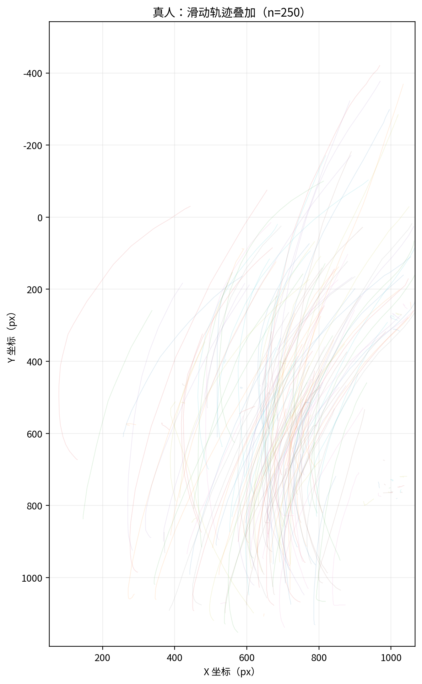 | 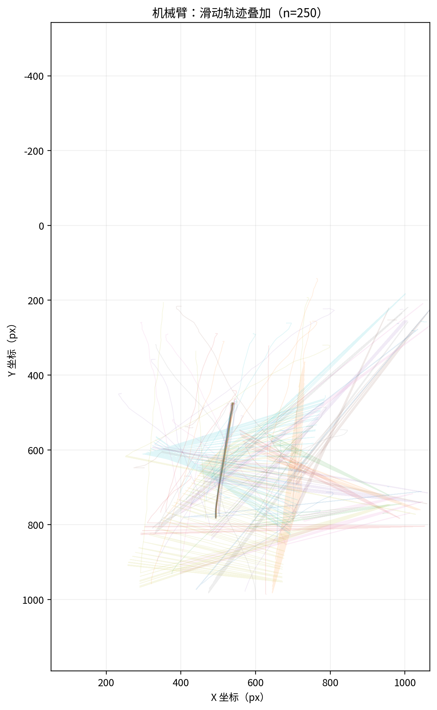 |
| **鼠标点击器** | **代码开发脚本** |
| 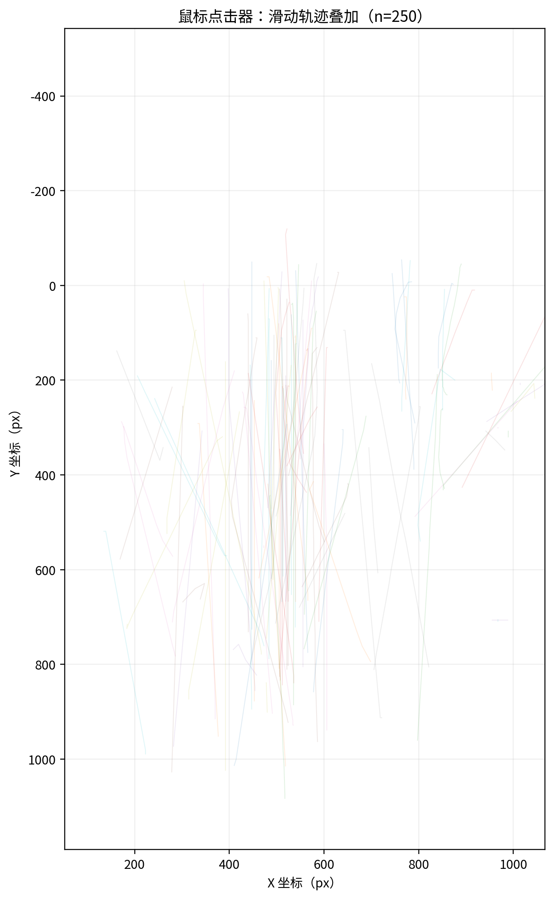 | 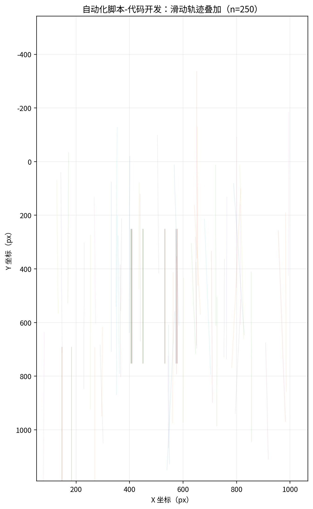 |
| **屏幕录制脚本** | **自动滑屏点赞器** |
| 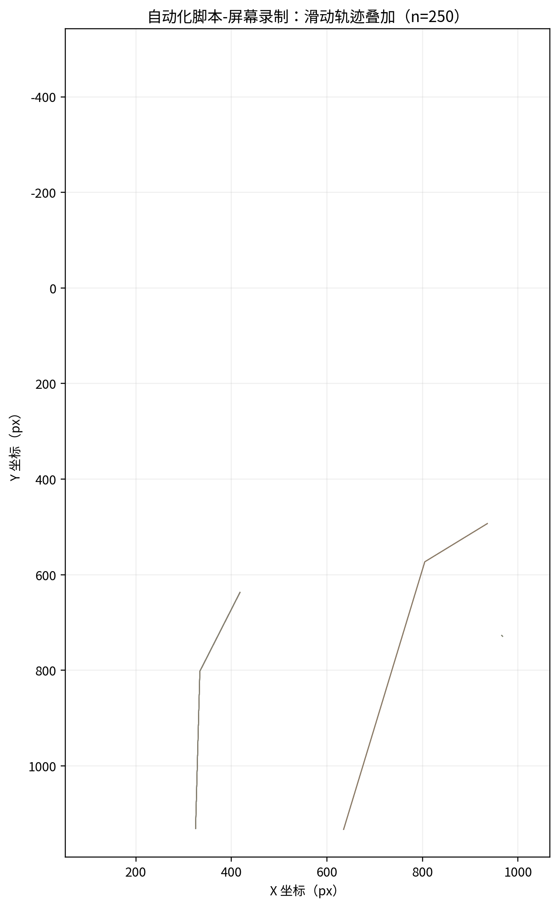 | 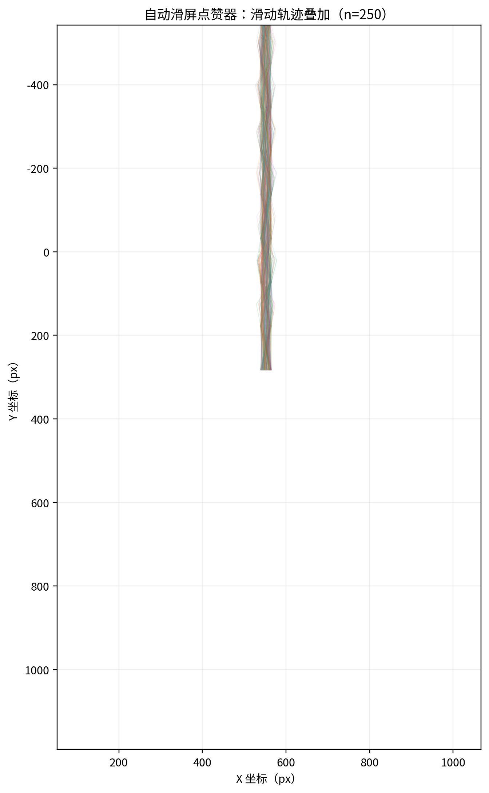 |
| **刷屏器一** | **刷屏器二** |
| 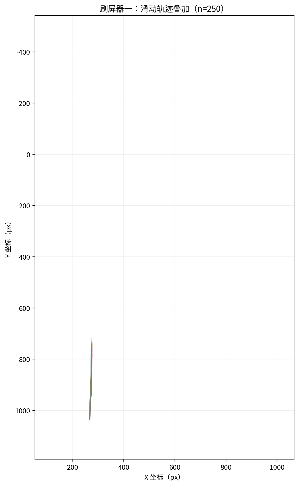 | 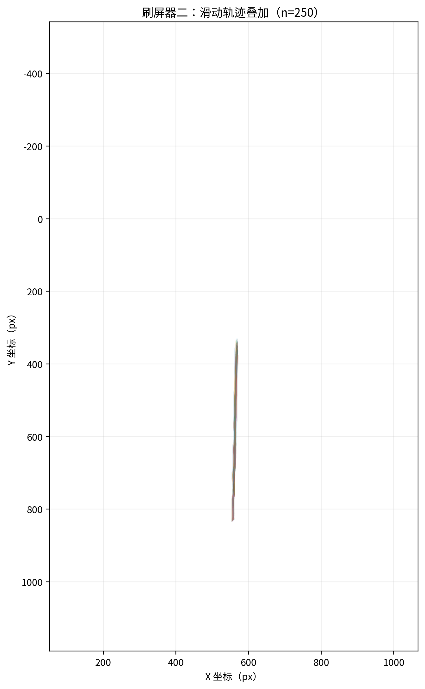 |

真人的 250 条轨迹发散成一片扇形，起点、终点、弯曲程度各不相同；机器的轨迹要么高度重合成几条线，要么集中在一个很小的坐标区域内。

### 6. 滑动平均曲率 ⚠️ 与第一轮不一致

- 代码脚本 / 屏幕录制 / 自动滑屏点赞器 / 鼠标点击器 / HID：整体曲率**很低**，轨迹更直、更规则。
- **真人**：分布更分散，P95 明显更高。多数滑动较平滑，但尾部存在较多弯曲或不稳定轨迹，推测由自然手部偏移造成。
- **机械臂**：**曲率波动最大**，P75 和 P95 都偏高，滑动轨迹中存在大量非直线或轨迹抖动。
- 刷屏器一 / 二：介于真人和自动化之间，刷屏器二整体略高。

> 注意机械臂在这一维**比真人还"弯"**。它的破绽不是"太直"，而是那种弯曲是机械运动特有的**规律歪曲**，不是人手随机自然的绕。

### 7. 滑动速度波动 ⚠️ 与第一轮不一致

- 只有**自动化脚本**速度波动保持为固定值，其余方式均呈明显的范围分布。
- **真人、刷屏器一**：分布高度接近，变化平滑连续，符合"速度平滑增至峰值再平滑下降"。
- **机械臂、刷屏器二、自动滑屏点赞器、鼠标点击器**：分布也高度接近，同样符合先增后降，但速度变化呈**陡增、陡降**。
- **HID**：呈现两个相对集中的区域——一批样本集中在 0.3–0.4（滑动平稳），另一批集中在 0.65–0.85（有明显起伏），可能是轨迹中存在加速、减速、停顿或采样节奏变化。

> 这是区分力最强的单一维度。

---

## 三、传感器组：机器操作时，手机是死的

这两个维度不看操作本身，看**手机的"身体反应"**。必须按手机状态分层解读。

### 8. 线性加速度合量

| 场景 | 结论 |
|---|---|
| 室内 · 平放手机 | 除机械臂外全部为 **0**。真人为 0 是因为手机受桌面支撑、手指的力被桌面吸收；机械臂少量不为 0，推测是支架镂空、力未被完全吸收 |
| 室内 · 竖放手机 | **只有真人和刷屏器一呈范围变化**，真人尤其明显，其余全为 0。竖放时手机更容易被触碰带动，而这两者都是通过**实体物体**操作屏幕 |
| 室内 · 手持 · 坐着 | **真人呈明显范围变化**（手指、手腕位置变化带来手机空间位移）；其余方式幅度偏小，只是手持时的自然抖动 |
| 室内 · 手持 · 行走 | 所有方式都呈明显范围变化——身体晃动盖过了操作本身 |
| 地铁 · 手持 · 坐着 | 所有方式都呈明显范围变化——环境振动盖过了操作本身 |

| 室内 · 平放 | 室内 · 竖放 |
|---|---|
| 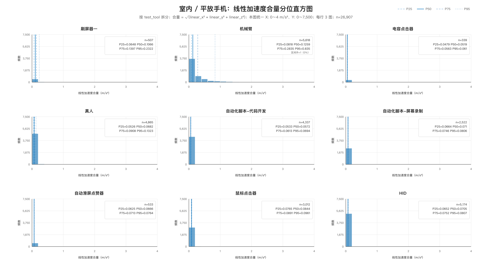 | 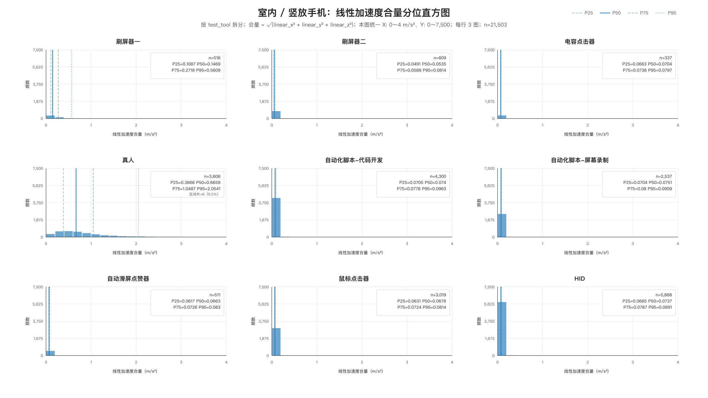 |
| **室内 · 手持 · 坐着** | **室内 · 手持 · 行走** |
| 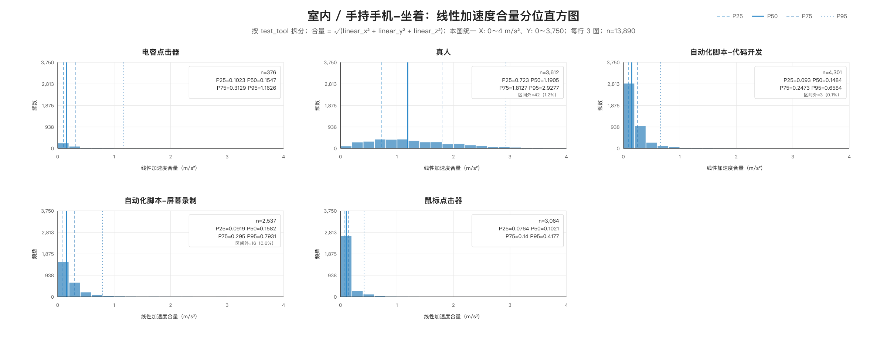 | 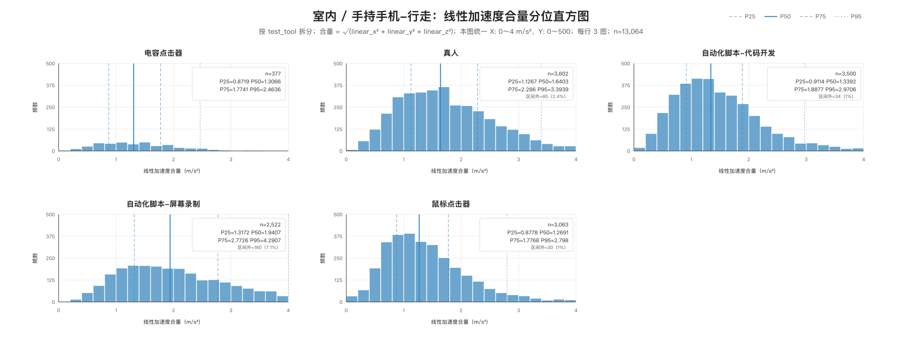 |
| **地铁 · 手持 · 坐着** | **地铁 · 手持 · 坐着（补充）** |
| 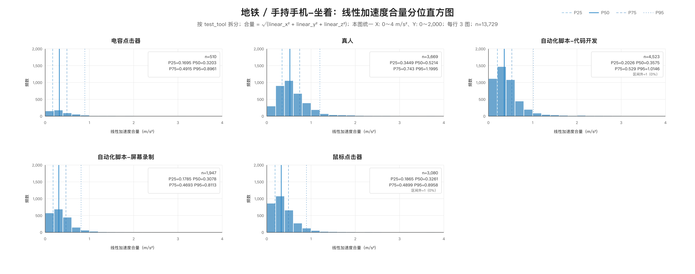 | 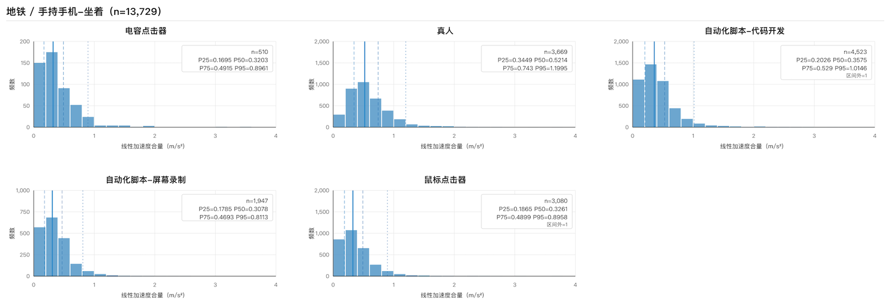 |

### 9. 陀螺仪合量

| 场景 | 结论 |
|---|---|
| 室内 · 平放手机 | 全部接近 0，设备姿态稳定 |
| 室内 · 竖放手机 | **只有真人呈范围变化**，其余全为 0 |
| 室内 · 手持 · 坐着 | **真人呈明显范围变化**，手指手腕动作带来手机的轻微转动、倾斜 |
| 室内 · 手持 · 行走 | 所有方式均呈明显范围变化 |
| 地铁 · 手持 · 坐着 | **除真人外全部为 0** —— 地铁带来的更多是空间上的直线位移，不涉及手机转动倾斜；而真人操作会带来真实的转动与倾斜 |

| 室内 · 平放 | 室内 · 竖放 |
|---|---|
| 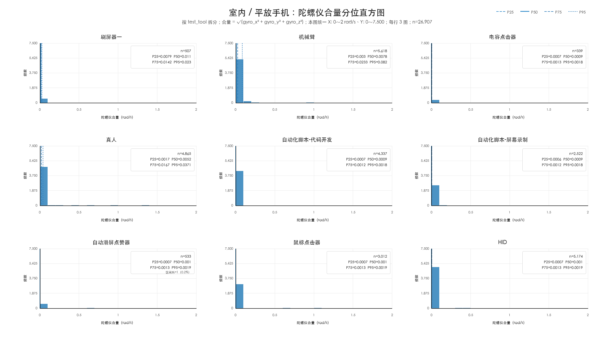 | 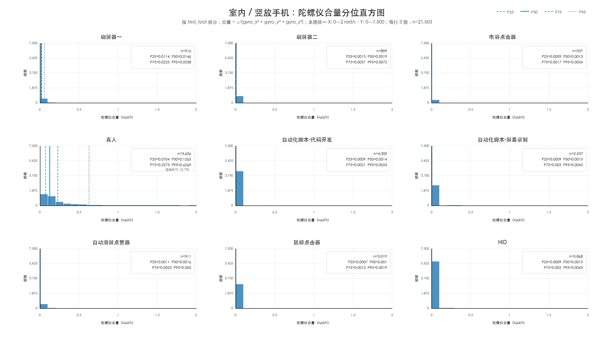 |
| **室内 · 竖放（补充）** | **室内 · 手持 · 坐着** |
| 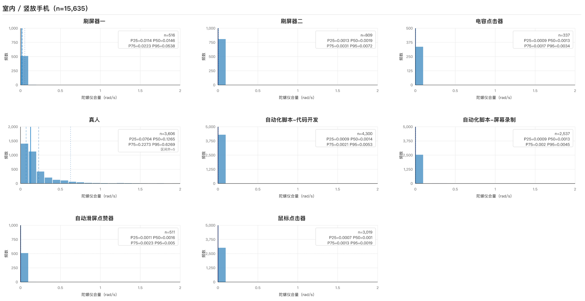 | 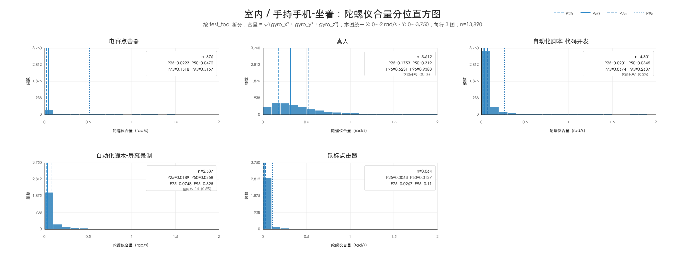 |
| **室内 · 手持 · 坐着（补充）** | **室内 · 手持 · 行走** |
| 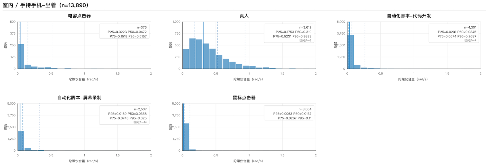 | 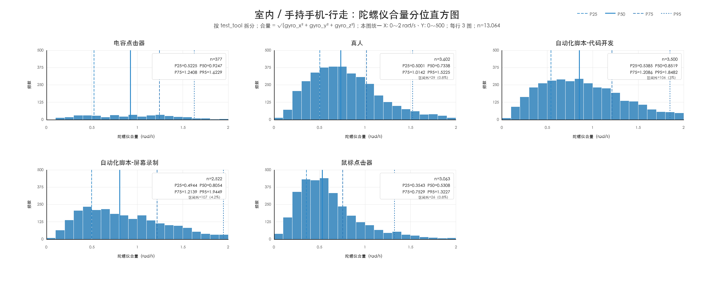 |
| **地铁 · 手持 · 坐着** | |
| 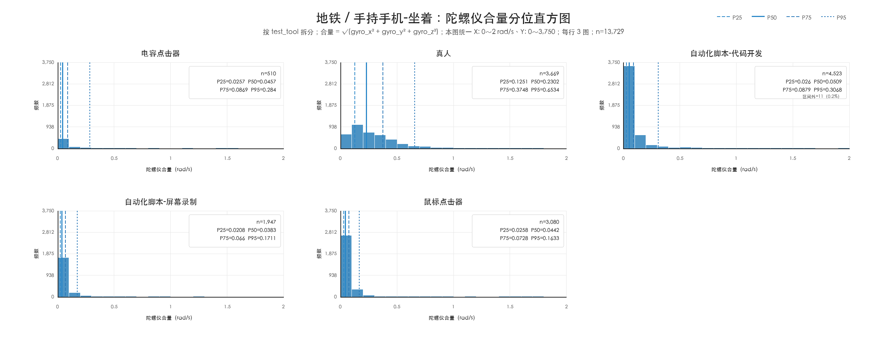 | |

> **两个反直觉的发现：**
> 1. "竖放手机"这个看似普通的场景，区分力意外地强——真人几乎是唯一能让竖放手机产生姿态变化的操作方式。
> 2. 地铁场景下**陀螺仪比线性加速度更有用**：车厢振动会污染加速度，但不会污染旋转。
>
> **反过来说，"行走"和"地铁"场景会同时污染两个维度**，此时这两维应降权，回退到压力 / 面积 / 轨迹判断。

---

## 附：各工具特征速查

| 工具 | 主要可识别特征 | 区分难度 |
|---|---|---|
| **真人** | 接触面积最大、压力分布宽；滑动速度较快、速度波动和曲率明显；手持时传感器合量高 | 与软件类、HID、鼠标易分；与机械臂需多维组合 |
| **代码脚本** | 压力恒 1、压力波动 0、接触面积 0；速度波动极低、路径冗余和曲率接近 0 | 极易与真人区分；与 HID / 屏幕录制需结合速度和轨迹形态 |
| **屏幕录制脚本** | 压力接近 1、接触面积 0；速度波动极低，但平均速度和路径冗余呈固定录制模式 | 易与真人区分；靠固定的速度 / 冗余值与代码脚本区分 |
| **鼠标点击器** | 接触面积≈0、压力常见 0.5、压力波动高；滑动平均速度最低 | 与脚本、真人、物理硬件都较易区分 |
| **机械臂** | 压力偏低、接触面积中等；速度波动高，曲率和路径冗余尾部明显 | **最难**。与脚本易分，与真人同为真实接触，只在压力更低、轨迹更集中上露馅 |
| **自动滑屏点赞器** | 压力恒 1、接触面积≈0；**滑动平均速度最高**；传感器合量低 | 极易与真人区分；靠极高速度与软件注入类区分 |
| **刷屏器一** | 压力低且稳定、接触面积中高；**速度波动系数最高**；传感器合量低 | 特征鲜明 |
| **刷屏器二** | 接触面积高、压力约 0.27；速度较慢，速度波动高但低于刷屏器一 | 靠压力、面积、速度与刷屏器一区分 |
| **电容点击器** | 压力约 0.244、接触面积较高 | 点击维度可识别 |
| **HID** | 压力恒 1、压力波动 0、接触面积 0；传感器合量低 | **与代码脚本极接近**，单靠压力 / 面积难分，需速度曲线和轨迹形态辅助 |
