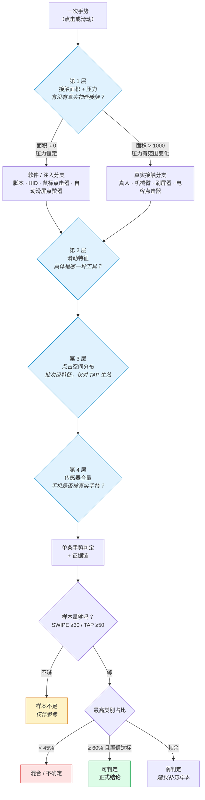

# 03 · 判定规则

**中文** · [English](./en/03-decision-rules.md)

## 判定链路：四层递进

不是把 9 个维度一次性丢进去打分，而是分层收敛：



### 第 1 层：分大类

| 条件 | 候选 |
|---|---|
| 接触面积 ≈ 0、压力恒定 | 脚本 / HID / 鼠标点击器 / 自动滑屏类 |
| 接触面积明显非 0、压力呈范围变化 | 真人 / 机械臂 / 刷屏器 / 电容点击器 |

### 第 2 层：细分工具

| 接触面积 | 滑动表现 | 倾向 |
|---|---|---|
| 无 | 速度波动极低 + 路径近直线 | 代码开发脚本 |
| 无 | 固定的录制速度 / 路径冗余 | 屏幕录制脚本 |
| 无 | 极高速滑动 | 自动滑屏点赞器 |
| 无 | 低速 + 压力约 0.5 | 鼠标点击器 |
| 大 | 自然速度、自然曲率 | 真人 |
| 中等 | 低压力 + 机械轨迹 | 机械臂 / 刷屏器类 |

### 第 3 层：点击空间分布

| 点击空间表现 | 接触面积 | 倾向 |
|---|---|---|
| 固定点高度重复 | 0 | 脚本 / 屏幕录制 / 鼠标 / HID |
| 固定点高度重复 | 非 0 | 机械臂 / 电容点击器 / 刷屏器 |
| 局部矩形偏移 | 0 | HID 或带偏移的脚本 |
| 局部矩形偏移 | 非 0 | 机械臂或其他物理工具 |
| 大范围随机 | 0 | 代码脚本 / HID / 鼠标随机 |
| 大范围随机 | 非 0 | 真人 / 机械臂随机 |

> 点击空间是**批次级**特征，少量单点数据不能可靠区分固定、偏移和随机。默认需要 ≥50 条 TAP 才计算。

### 第 4 层：传感器辅助

| 传感器表现 | 接触面积 | 倾向 |
|---|---|---|
| 加速度低、陀螺仪低 | 0 | 静置的脚本 / HID / 鼠标 / 自动滑屏 |
| 加速度低、陀螺仪低 | 非 0 | 静置的物理工具，或平放手机的真人 |
| 加速度中高、陀螺仪中高 | 非 0 | **真人手持，增强证据** |
| 加速度中高、陀螺仪中高 | 0 | 手持手机上运行脚本，或外部注入 |
| 行走场景传感器很高 | 任意 | 先标记行走状态，再用压力 / 面积 / 轨迹判工具 |

---

## 规则清单

`priority` 越小越先参与分流；同一条手势可命中多条规则，得分累加。

| ID | 优先级 | 适用 | 条件 | 判定 | 置信 |
|---|---|---|---|---|---|
| R001 | 1 | TAP/SWIPE | 接触面积 ≤1 且 压力≈1 且 压力波动≈0 | 脚本 / HID / 自动滑屏点赞器候选 | 高 |
| R002 | 1 | TAP/SWIPE | 接触面积 ≤1 且（压力≈0.5 或 压力波动很高） | 鼠标点击器候选 | 高 |
| R003 | 1 | TAP/SWIPE | 接触面积 >1000 | 真人 / 机械臂 / 刷屏器 / 电容点击器候选 | 高 |
| R004 | 2 | SWIPE | 无接触 + 压力≈1 + 速度波动极低 + 路径近直线 + 曲率极低 | 自动化脚本-代码开发 | 高 |
| R005 | 2 | SWIPE | 无接触 + 压力≈1 + 速度波动低 + 路径冗余落在录制区间 | 自动化脚本-屏幕录制 | 高 |
| R006 | 2 | SWIPE | 无接触 + 压力≈1 + 平均速度 >7500 px/s | 自动滑屏点赞器 | 高 |
| R007 | 2 | SWIPE | 无接触 + 平均速度 <800 px/s | 鼠标点击器 | 高 |
| R008 | 2 | SWIPE | 接触面积 >15000 + 速度 >4000 + 速度波动自然 | 真人 | 高 |
| R009 | 2 | SWIPE | 接触面积 4000–10000 + 压力 <0.20 + 速度波动 >0.55 | 机械臂 / 刷屏器一候选 | 中 |
| R010 | 3 | SWIPE | 速度波动 >0.90 + 接触面积 8500–10500 + 压力 0.16–0.20 | 刷屏器一 | 高 |
| R011 | 3 | SWIPE | 接触面积 13000–15000 + 压力 0.25–0.30 + 速度 900–1300 | 刷屏器二 | 高 |
| R012 | 3 | TAP | 接触面积 10000–14000 + 压力 0.20–0.27 + 压力波动较低 | 电容点击器 | 中高 |
| R013 | 3 | TAP/SWIPE | 无接触 + 压力恒 1 + 压力波动 0 + 速度波动不极低 | HID | 中 |
| R014 | 4 | TAP | 坐标唯一率很低 或 主导坐标占比很高 | 固定位置点击 | 高 |
| R015 | 4 | TAP | 点击范围是几十到百余像素的局部区域 | 固定位置带坐标偏移 | 高 |
| R016 | 4 | TAP | 范围 >450×800 且坐标唯一率接近 1 | 随机位置点击 | 高 |
| R017 | 5 | TAP/SWIPE | 手持行走 且 线性加速度、陀螺仪显著升高 | 真人手持状态增强证据 | 中 |
| R018 | 5 | TAP/SWIPE | 平放 / 竖放 且 线性加速度、陀螺仪很低 | 静置手机状态证据 | 中 |

---

## 代码里的实际阈值

**以 [`src/gesture_behavior_classifier/config/default_rules.json`](../src/gesture_behavior_classifier/config/default_rules.json) 为准**，改 JSON 不需要动代码。主要几组：

```jsonc
{
  "feature_thresholds": {
    // 第 1 层分流
    "contact_area_zero_max":  1.0,      // ≤ 此值视为无真实接触
    "physical_contact_min":   1000.0,   // ≥ 此值视为真实物理接触
    "pressure_one_min":       0.95,     // 压力"恒为 1"的判定区间
    "pressure_one_max":       1.05,
    "pressure_mouse_min":     0.45,     // 鼠标点击器的 0.5 压力模式
    "pressure_mouse_max":     0.55,
    "pressure_static_coeff_max": 0.01,  // 压力波动视为 0 的上限

    // 软件类细分
    "code_speed_fluct_max":       0.03,   // 代码脚本速度波动上限
    "swipe_straight_redundancy_max": 0.005,
    "low_curvature_max":          0.002,
    "screen_record_redundancy_min": 0.015, // 屏幕录制的路径冗余区间
    "screen_record_redundancy_max": 0.07,
    "auto_swiper_speed_min":      7500.0,  // 自动滑屏点赞器
    "mouse_speed_max":            800.0,   // 鼠标点击器

    // 物理接触类细分
    "human_contact_area_min":     15000.0,
    "human_pressure_min":         0.30,
    "human_speed_min":            4000.0,
    "mechanical_contact_area_min": 4000.0,  // 机械臂
    "mechanical_contact_area_max": 10000.0,
    "mechanical_pressure_max":     0.20,
    "brush1_speed_fluct_min":      0.90,    // 刷屏器一
    "capacitor_contact_area_min":  10000.0  // 电容点击器
  }
}
```

> ⚠️ **注意 `contact_area_zero_max = 1` 与 `physical_contact_min = 1000` 之间存在一段空档。**
> 落在 1–1000 之间的手势不会进入任何一个大类分支，通常会被判为"未知"。
> 这是有意保守——但如果你的设备在这个区间产生大量数据，需要重新标定。

## 批次判定与最低样本量

单条手势随机性很高，引擎**默认不把单条预测作为正式结论**：

| 参数 | 默认值 |
|---|---|
| 分组字段 | `gesture_type` |
| SWIPE 最低样本量 | 30 |
| TAP 最低样本量 | 50 |
| 点击空间最低样本量 | 50 |
| 稳定多数比例 | 0.60 |
| 判为"混合 / 不确定"的比例下限 | 0.45 |

输出的 `分组正式判定.csv` 有四种状态：

| 状态 | 含义 |
|---|---|
| `样本不足` | 低于最低样本量，只保留单条预测作参考 |
| `不稳定` | 最高类别占比 <45%，可能混合了多种行为，或规则证据冲突 |
| `弱判定` | 占比或平均置信度一般，建议补充样本后复核 |
| `可判定` | 占比 ≥60% 且平均置信度达标 |

线上未知数据通常只有 `gesture_type`，所以默认不依赖 `test_site` / `phone_status` / `test_method`。如果你的数据能提供更多上下文，可以指定分组字段：

```bash
gesture-classify --group-by gesture_type,phone_status ...
```
