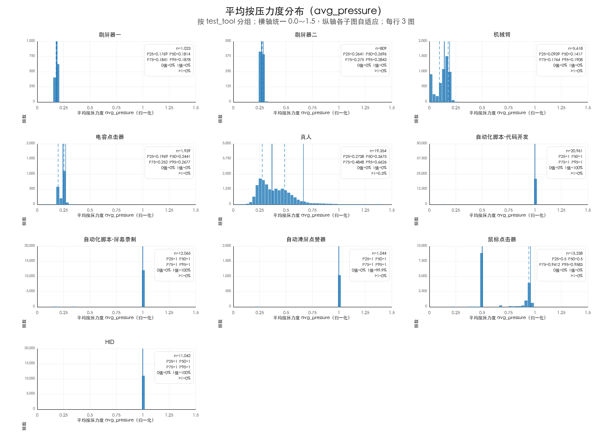
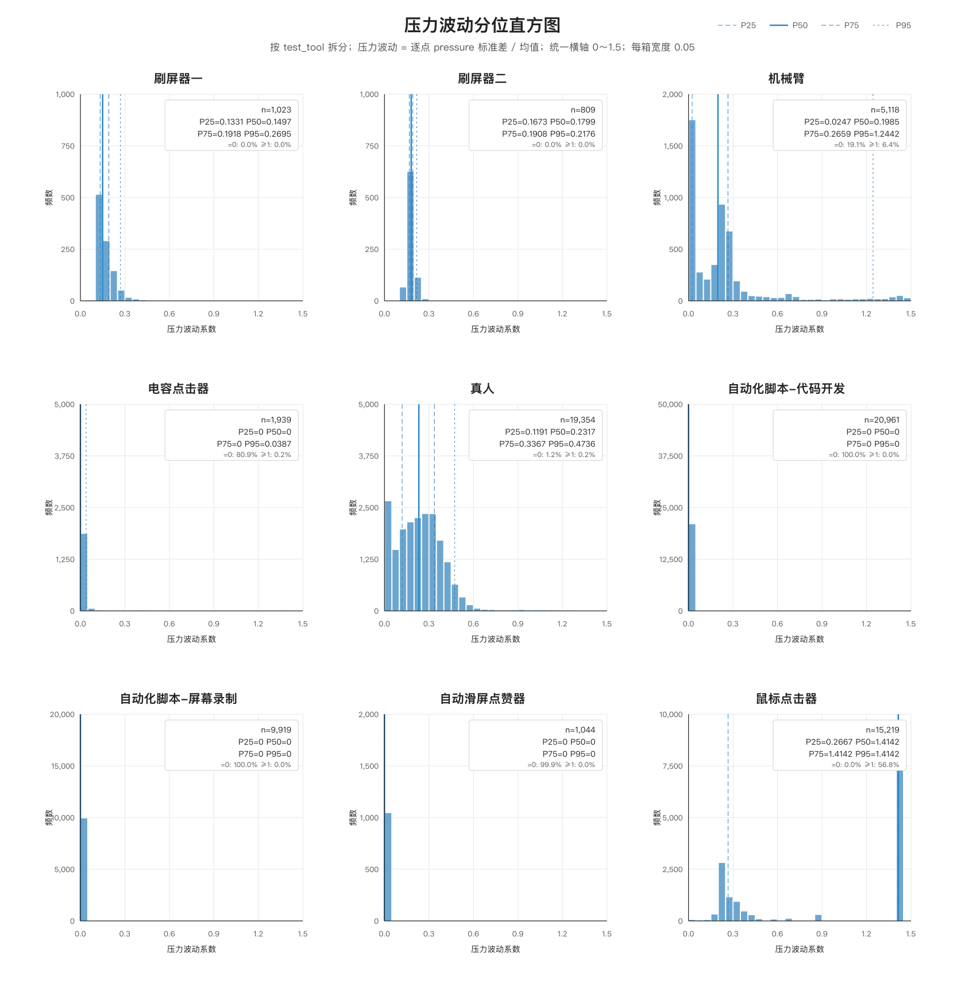
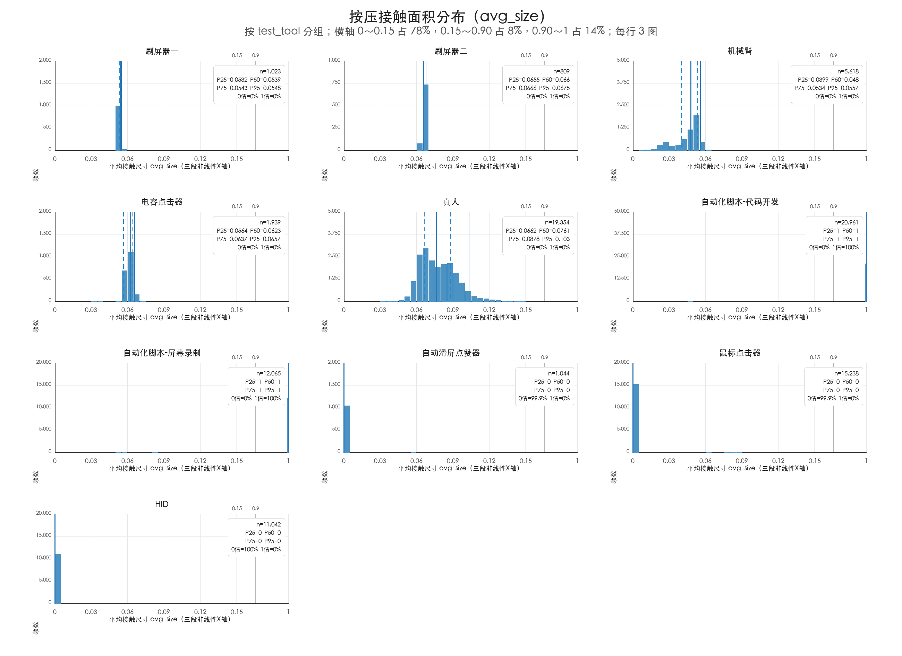
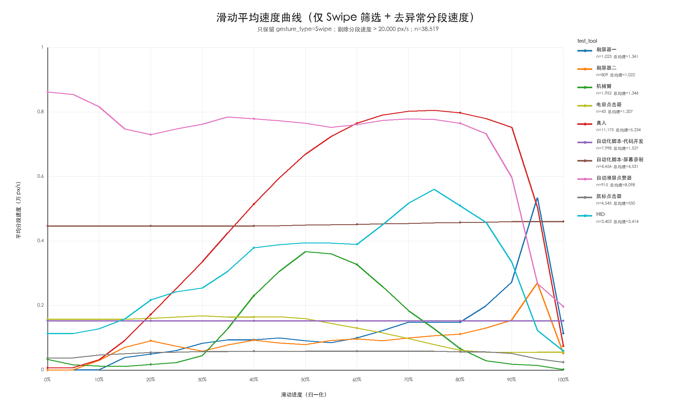
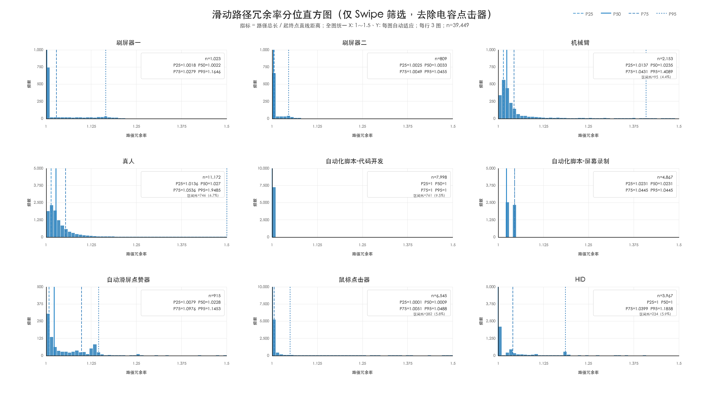
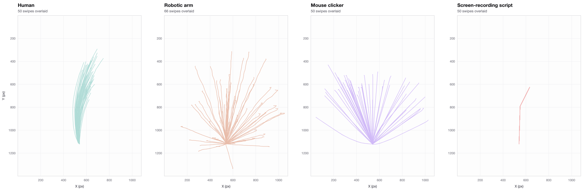
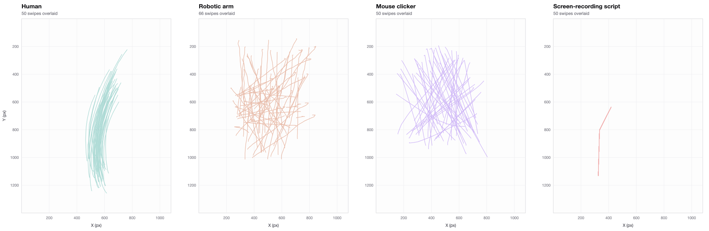
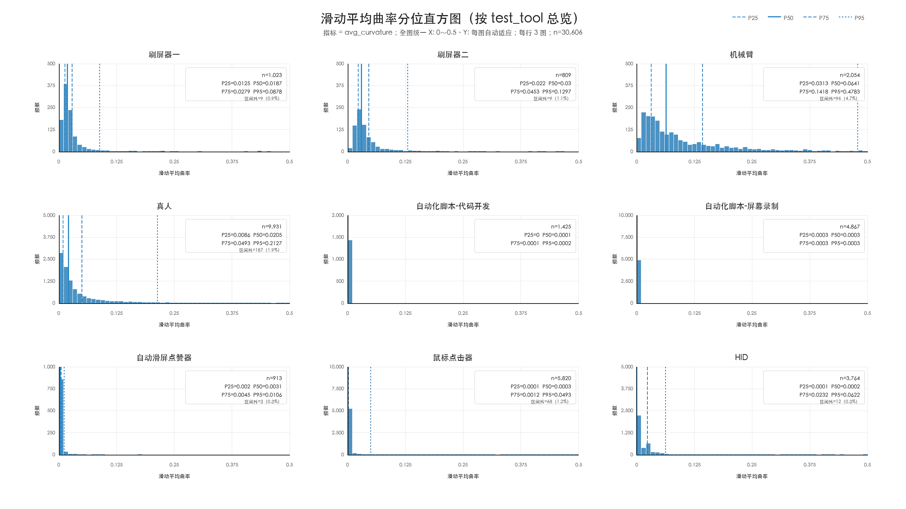
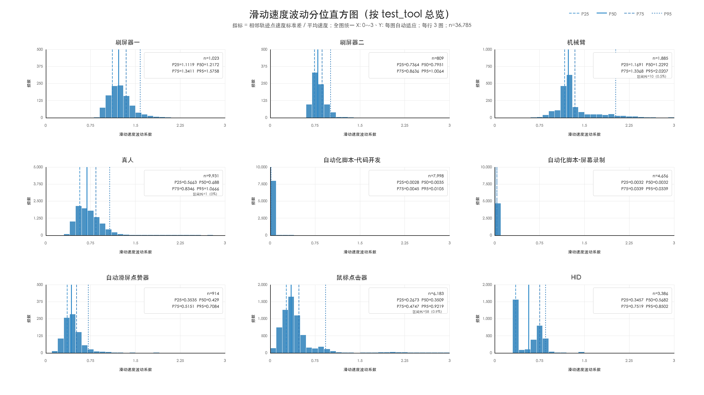

# 02 · The nine dimensions

**English** · [中文](../02-九维度分析.md)

All findings come from round 2 (300–500 samples per task). Dimensions marked
**⚠ reversed in round 2** produced a different conclusion than round 1 — a useful
reminder that small samples mislead.

> **Reading the figures.** The statistical charts were produced during the original
> analysis and are labelled in Chinese. Each one below carries a caption telling you
> exactly what to look at, and the numbers are repeated in English. Panel titles run
> in the order given in each caption. The trajectory figures have been re-rendered
> in English.

---

## Group 1 · Pressure — a machine's hand has no weight to it

### 1. Mean pressure `avg_pressure`

Chinese chart. Panels, reading left→right and top→bottom: screen-swiper A,
screen-swiper B, robotic arm, capacitive clicker, human, hand-written script,
screen-recording playback, auto-swipe/liker, mouse clicker. X axis = mean pressure,
Y axis = frequency.

| Tool | What it looks like |
|---|---|
| Hand-written script / screen-recording / auto-liker / HID | **Pinned at exactly 1.0.** Pressure is perfectly uniform |
| Mouse clicker | A clearly **bimodal** distribution: P50 = 0.5, but P75/P95 sit near the high end — not a single fixed value |
| Human | The most naturally spread distribution, with real variation |
| Screen-swipers / robotic arm / capacitive clicker | Concentrated in a **low** band, narrow range |

On this dimension alone the mouse clicker, screen-swipers, robotic arm and
capacitive clicker cannot be told apart — hence the next dimension.

### 2. Pressure variability

> Pressure variability = std. dev. / mean of `pressure` within one gesture

Chinese chart, 9 panels in the same order as above. Each panel prints n and the
P25/P50/P75/P95 quantiles. X axis = pressure variability coefficient, bin width 0.05.

| Tool | n | P50 | P95 | What it looks like |
|---|---:|---:|---:|---|
| Human | 19,354 | **0.2317** | 0.4736 | A natural bell curve |
| Hand-written script | 20,961 | 0 | 0 | **100.00% exactly zero** |
| Screen-recording playback | 9,919 | 0 | 0 | **100.00% exactly zero** |
| Auto-swipe/liker | 1,044 | 0 | 0 | 99.9% exactly zero |
| Mouse clicker | 15,219 | **1.4142** | 1.4142 | Piles up on one oddly specific constant — pressure jumps rather than varies smoothly |
| Robotic arm | 5,118 | 0.1985 | **1.2442** | A long tail; some gestures swing wildly |
| Capacitive clicker | 1,939 | 0 | 0.0387 | 80.9% exactly zero, with a small tail |
| Screen-swiper A | 1,023 | 0.1497 | 0.2695 | Low but non-zero and stable |
| Screen-swiper B | 809 | 0.1799 | 0.2176 | Low but non-zero and stable |

### 3. Contact area

Chinese chart. Same panel ordering. X axis = contact area, Y axis = frequency.

| Tool | What it looks like |
|---|---|
| Human | **Largest area and the widest spread** |
| Screen-swipers, capacitive clicker, robotic arm | Non-zero area, but tightly concentrated |
| Hand-written script / screen-recording playback | Constant **1** — both inject synthetic gesture events through the Android accessibility service, so 1 is almost certainly a placeholder written by the injection layer, not a real contact area |
| Auto-liker / mouse clicker / HID | Exactly **0** — no touch ellipse at all |

> This dimension is the first split in the whole method: **did physical contact
> actually happen?** The engine branches on it — `contact_area ≤ 1` goes down the
> software/injection path, `> 1000` down the physical-touch path.

---

## Group 2 · Trajectory — a machine draws with a ruler

### 4. Normalised swipe speed profile

Chinese chart. X axis = normalised progress through the swipe (0→100%),
Y axis = speed. One curve per tool.

**Group A — fastest, with clear phase structure**

- **Human**: the textbook accelerate-then-decelerate profile. Speed climbs, peaks
  around 70–85% of the way through, then drops sharply at the end. Exactly what a
  real gesture does: start slow, accelerate through the middle, brake to a stop.
- **Auto-swipe/liker**: very fast overall, and already fast from the first sample.
  Holds a high speed through the middle, drops after 90%. **No gradual human-like
  ramp** — a device running to a fixed cadence.

**Group B — medium speed**

- **Screen-recording playback**: essentially a flat line around 4500 px/s.
- **HID**: superficially close to a human, but its variation is **piecewise-linear**
  rather than smooth.

**Group C — slower and flatter**

- **Robotic arm**: has genuine acceleration and deceleration phases, but they rise
  and fall **uniformly**.
- **Screen-swipers A and B**: mild rise through the first two thirds, then an
  abrupt **spike** near the end — clearly anomalous.
- **Hand-written script / mouse clicker**: near-flat. Constant-velocity generation.

### 5. Path redundancy ⚠ reversed in round 2

Chinese chart, analysis convention (1.0 = no detour). X axis = redundancy,
Y axis = frequency.

- **Hand-written script and mouse clicker**: highly concentrated. The script sits at
  1 (no detour whatsoever); the mouse clicker is mostly 1, and where it is not, the
  excess is negligible — effectively no detour either.
- **Human, robotic arm, auto-liker, both screen-swipers**: all show a real range.
  - Human and robotic arm decline **very similarly**. The separation is in the tail:
    **human P95 = 1.9485 vs. robotic arm P95 = 1.4089.** A human produces far more
    genuinely meandering strokes; the arm stays tidier.
  - Auto-liker and both screen-swipers drop off abruptly — visibly anomalous.

> This is one of the dimensions where the robotic arm comes closest to a human.
> It only gives itself away in the tail of the distribution.

### Trajectory overlays

Every stroke from a blind-test capture, overlaid. **These have been re-rendered in
English** from the data in [`人工测试数据/`](../../人工测试数据) — reproduce them with
[`.github/gen_traj_en.py`](../../.github/gen_traj_en.py).

<b>Start-aligned.</b> Every stroke has been translated so it begins at the same
origin, which removes "where on the screen it happened" and isolates pure shape.
This is the fair comparison, because the capture tasks used different
start-position policies.

- **Human** — a tight sheaf of arcs all bending the same way. That is the natural
  arc of a thumb or finger pivoting about a joint.
- **Robotic arm** — a starburst radiating in every direction, each ray fairly
  straight with visible mechanical kinks along it.
- **Mouse clicker** — a clean fan of dead-straight rays.
- **Screen-recording playback** — 50 swipes collapse to a single polyline. It is
  replaying one recording.

<b>As captured</b>, without alignment — showing where on the screen each gesture
actually landed. Note the capture tasks differed: the human set used a fixed start
position while the robotic arm set used random positions, so the <i>spread</i> here
reflects task design as much as device behaviour. Judge shape from the aligned
figure above, not from this one.

### 6. Mean curvature ⚠ reversed in round 2

Chinese chart. Blue dashed line = P75, red dashed line = P95.

- Hand-written script, screen-recording playback, auto-liker, mouse clicker and HID
  all have **very low** curvature — straighter, more regular paths.
- **Human**: a more dispersed distribution with a distinctly higher P95. Most swipes
  are smooth, but the tail holds many curved or unsteady strokes — natural hand drift.
- **Robotic arm**: the **largest** curvature variation of all, with both P75 and P95
  elevated. Plenty of non-straight, jittery strokes.
- Screen-swipers A and B fall between human and the software classes; B slightly higher.

> Note that the robotic arm is *curvier* than a human on this dimension. Its tell is
> not that it is too straight — it is that the curvature is **mechanically regular
> distortion**, not the random, organic wander of a hand.

### 7. Speed variability ⚠ reversed in round 2

Chinese chart. X axis = speed variability coefficient.

- Only the **hand-written script** keeps speed variability at a fixed value; every
  other method spans a real range.
- **Human and screen-swiper A** have near-identical distributions: smooth and
  continuous, matching a speed that rises evenly to a peak and falls evenly away.
- **Robotic arm, screen-swiper B, auto-liker and mouse clicker** also rise-then-fall,
  but the change is **abrupt in both directions**.
- **HID** is **bimodal**: one cluster around 0.3–0.4 (smooth, low variation) and
  another around 0.65–0.85 (pronounced variation — likely acceleration, braking,
  pauses, or a shifting sampling cadence).

> This is the single most discriminative dimension.

---

## Group 3 · Sensors — while a machine works, the phone is dead

These two dimensions ignore the gesture itself and look at the **phone's own bodily
response**. They must be read per phone state.

### 8. Linear acceleration magnitude

| Scenario | Finding |
|---|---|
| Indoor · flat | **0 for everything except the robotic arm.** A human reads 0 because the desk absorbs the force; the arm occasionally registers because the stand is open-frame and does not absorb it fully |
| Indoor · upright in a stand | **Only the human and screen-swiper A show a range**, the human markedly so; everything else is 0. An upright phone is far easier to nudge — and these two are the ones driving the screen with a *physical object* |
| Indoor · handheld, seated | **The human shows a clear range** (finger and wrist motion displaces the phone). Other methods show only the small natural tremor of a held phone |
| Indoor · handheld, walking | Every method shows a wide range — body motion swamps the gesture |
| Subway · handheld, seated | Every method shows a wide range — ambient vibration swamps the gesture |

Chinese charts, one per scenario, in [`docs/images/`](../images):
`09-accel-flat`, `09-accel-vertical`, `09-accel-hand-sitting`,
`09-accel-hand-walking`, `09-accel-metro`.

### 9. Gyroscope magnitude

| Scenario | Finding |
|---|---|
| Indoor · flat | Everything near 0; the phone's attitude is stable |
| Indoor · upright in a stand | **Only the human shows a range**; everything else is 0 |
| Indoor · handheld, seated | **The human shows a clear range** — finger and wrist motion tilts and rotates the phone slightly |
| Indoor · handheld, walking | Every method shows a wide range |
| Subway · handheld, seated | **0 for everything except the human.** A moving train mostly produces linear displacement, not rotation — but a human operating the phone still tilts and turns it |

Chinese charts: `10-gyro-flat`, `10-gyro-vertical`, `10-gyro-hand-sitting`,
`10-gyro-hand-walking`, `10-gyro-metro`.

> **Two counter-intuitive findings:**
> 1. The unremarkable-looking "phone upright in a stand" scenario discriminates
>    surprisingly well — a human is almost the only operator that can make an
>    upright phone change attitude at all.
> 2. On the subway the **gyroscope beats linear acceleration**: carriage vibration
>    contaminates acceleration but not rotation.
>
> Conversely, **walking and subway scenarios contaminate both dimensions**, and both
> should be down-weighted there in favour of pressure, contact area and trajectory.

---

## Appendix · Per-tool signature summary

| Tool | Identifying features | How hard to separate |
|---|---|---|
| **Human** | Largest contact area, widest pressure spread; fast swipes with real speed variability and curvature; elevated sensor magnitudes when handheld | Easy against software, HID and the mouse clicker; needs multiple dimensions against the robotic arm |
| **Hand-written script** | Pressure pinned at 1, pressure variability 0, contact area 0; speed variability, path redundancy and curvature all ≈ 0 | Trivial against a human or any real-contact tool; needs speed and trajectory shape to separate from HID and recorded playback |
| **Screen-recording playback** | Pressure ≈ 1, contact area 0; speed variability ≈ 0, but path redundancy retains a fixed recorded shape | Trivial against a human; separated from the hand-written script by its fixed speed / redundancy / curvature values |
| **Mouse clicker** | Contact area ≈ 0, pressure often 0.5, high pressure variability; the slowest mean swipe speed | Reasonably easy against everything else |
| **Robotic arm** | Low pressure, medium contact area; high speed variability, pronounced curvature and redundancy tails | **The hardest.** Trivial against scripts, but it shares real physical contact with a human — only lower pressure and tighter trajectories give it away |
| **Auto-swipe/liker** | Pressure pinned at 1, contact area ≈ 0; **the fastest mean swipe speed**; low sensor magnitudes | Trivial against a human; separated from software injection by sheer speed |
| **Screen-swiper A** | Low, stable pressure, medium-high contact area; **the highest speed variability of all**; low sensor magnitudes | Distinctive |
| **Screen-swiper B** | High contact area, pressure ≈ 0.27; slower, with high but sub-A speed variability | Separated from A by pressure, area and speed |
| **Capacitive clicker** | Pressure ≈ 0.244, fairly high contact area | Identifiable on the tap dimensions |
| **HID** | Pressure pinned at 1, pressure variability 0, contact area 0; low sensor magnitudes | **Very close to the hand-written script.** Pressure and area alone cannot separate them; needs the speed profile and trajectory shape |
