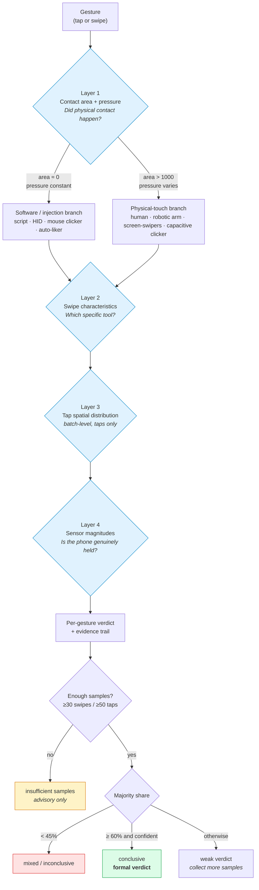

# 03 · Decision rules

**English** · [中文](../03-判定规则.md)

## The decision path: four narrowing layers

The nine dimensions are not thrown into one scorer. They converge in stages:



### Layer 1 — coarse split

| Condition | Candidates |
|---|---|
| Contact area ≈ 0, pressure constant | script / HID / mouse clicker / auto-swipe class |
| Contact area clearly non-zero, pressure varies | human / robotic arm / screen-swipers / capacitive clicker |

### Layer 2 — narrow to a specific tool

| Contact area | Swipe behaviour | Leans toward |
|---|---|---|
| none | Speed variability ≈ 0 + near-straight path | Hand-written script |
| none | Fixed recorded speed / redundancy | Screen-recording playback |
| none | Extremely fast | Auto-swipe/liker |
| none | Slow + pressure ≈ 0.5 | Mouse clicker |
| large | Natural speed, natural curvature | Human |
| medium | Low pressure + mechanical trajectory | Robotic arm / screen-swiper class |

### Layer 3 — tap spatial distribution

| Spatial pattern | Contact area | Leans toward |
|---|---|---|
| Same point, high repetition | 0 | script / playback / mouse / HID |
| Same point, high repetition | non-zero | robotic arm / capacitive clicker / screen-swiper |
| Local rectangular offset | 0 | HID, or a script with jitter |
| Local rectangular offset | non-zero | robotic arm or another physical tool |
| Wide random spread | 0 | script / HID / mouse with randomisation |
| Wide random spread | non-zero | human or robotic arm with randomisation |

> Spatial distribution is a **batch-level** feature. A handful of points cannot
> reliably distinguish fixed, offset and random. It needs ≥50 taps by default.

### Layer 4 — sensor corroboration

| Sensor picture | Contact area | Leans toward |
|---|---|---|
| Low acceleration, low gyro | 0 | Stationary script / HID / mouse / auto-swipe |
| Low acceleration, low gyro | non-zero | A stationary physical tool, or a human with the phone flat |
| Mid-to-high acceleration and gyro | non-zero | **Human, handheld — strong corroboration** |
| Mid-to-high acceleration and gyro | 0 | A script running on a phone someone is holding, or external injection |
| Very high in a walking scenario | any | Flag the walking state first, then judge the tool on pressure / area / trajectory |

---

## Rule list

Lower `priority` runs first. One gesture can match several rules; scores accumulate.

| ID | Pri | Applies to | Condition | Verdict | Conf. |
|---|---|---|---|---|---|
| R001 | 1 | tap/swipe | area ≤1 and pressure ≈1 and pressure variability ≈0 | script / HID / auto-liker candidate | high |
| R002 | 1 | tap/swipe | area ≤1 and (pressure ≈0.5 or pressure variability very high) | mouse clicker candidate | high |
| R003 | 1 | tap/swipe | area >1000 | human / arm / swiper / capacitive candidate | high |
| R004 | 2 | swipe | no contact + pressure ≈1 + speed variability very low + near-straight path + curvature ≈0 | hand-written script | high |
| R005 | 2 | swipe | no contact + pressure ≈1 + low speed variability + redundancy in the recorded-playback band | screen-recording playback | high |
| R006 | 2 | swipe | no contact + pressure ≈1 + mean speed >7500 px/s | auto-swipe/liker | high |
| R007 | 2 | swipe | no contact + mean speed <800 px/s | mouse clicker | high |
| R008 | 2 | swipe | area >15000 + speed >4000 + natural speed variability | human | high |
| R009 | 2 | swipe | area 4000–10000 + pressure <0.20 + speed variability >0.55 | robotic arm / screen-swiper A candidate | medium |
| R010 | 3 | swipe | speed variability >0.90 + area 8500–10500 + pressure 0.16–0.20 | screen-swiper A | high |
| R011 | 3 | swipe | area 13000–15000 + pressure 0.25–0.30 + speed 900–1300 | screen-swiper B | high |
| R012 | 3 | tap | area 10000–14000 + pressure 0.20–0.27 + low pressure variability | capacitive clicker | med-high |
| R013 | 3 | tap/swipe | no contact + pressure exactly 1 + pressure variability 0 + speed variability not extremely low | HID | medium |
| R014 | 4 | tap | Very low unique-coordinate ratio, or very high dominant-coordinate share | fixed-position tapping | high |
| R015 | 4 | tap | Tap region spans tens to a few hundred pixels | fixed position with jitter | high |
| R016 | 4 | tap | Region >450×800 and unique-coordinate ratio ≈ 1 | random-position tapping | high |
| R017 | 5 | tap/swipe | Handheld-walking and both sensor magnitudes clearly elevated | corroborates a handheld human | medium |
| R018 | 5 | tap/swipe | Flat/upright and both sensor magnitudes very low | corroborates a stationary phone | medium |

---

## The thresholds actually in the code

**[`default_rules.json`](../../src/gesture_behavior_classifier/config/default_rules.json)
is authoritative.** Edit the JSON; no code changes needed.

```jsonc
{
  "feature_thresholds": {
    // Layer 1 split
    "contact_area_zero_max":  1.0,      // at or below → treated as no real contact
    "physical_contact_min":   1000.0,   // at or above → treated as real physical contact
    "pressure_one_min":       0.95,     // band for "pressure pinned at 1"
    "pressure_one_max":       1.05,
    "pressure_mouse_min":     0.45,     // the mouse clicker's 0.5 pattern
    "pressure_mouse_max":     0.55,
    "pressure_static_coeff_max": 0.01,  // upper bound for "variability is zero"

    // Software-class refinement
    "code_speed_fluct_max":       0.03,
    "swipe_straight_redundancy_max": 0.005,
    "low_curvature_max":          0.002,
    "screen_record_redundancy_min": 0.015,
    "screen_record_redundancy_max": 0.07,
    "auto_swiper_speed_min":      7500.0,
    "mouse_speed_max":            800.0,

    // Physical-contact-class refinement
    "human_contact_area_min":     15000.0,
    "human_pressure_min":         0.30,
    "human_speed_min":            4000.0,
    "mechanical_contact_area_min": 4000.0,
    "mechanical_contact_area_max": 10000.0,
    "mechanical_pressure_max":     0.20,
    "brush1_speed_fluct_min":      0.90,
    "capacitor_contact_area_min":  10000.0
  }
}
```

> ⚠️ **There is a gap between `contact_area_zero_max = 1` and
> `physical_contact_min = 1000`.** A gesture landing between 1 and 1000 enters
> neither coarse branch and will usually be reported as *unknown*. This is
> deliberately conservative — but if your device produces a lot of data in that
> band, recalibrate.

## Batch verdicts and minimum sample size

A single gesture is too noisy, so the engine **does not treat a single-gesture
prediction as a formal result**:

| Parameter | Default |
|---|---|
| Grouping field | `gesture_type` |
| Minimum swipes | 30 |
| Minimum taps | 50 |
| Minimum taps for spatial distribution | 50 |
| Stable-majority share | 0.60 |
| Below this share → "mixed" | 0.45 |

`分组正式判定.csv` (*group verdicts*) reports one of four states:

| State | Meaning |
|---|---|
| `样本不足` *insufficient samples* | Below the minimum; only advisory per-gesture predictions are kept |
| `不稳定` *unstable* | Top class under 45% — likely mixed behaviour, or conflicting rule evidence |
| `弱判定` *weak verdict* | Share or mean confidence is mediocre; collect more samples and re-check |
| `可判定` *conclusive* | Share ≥60% with adequate confidence |

Production telemetry usually carries only `gesture_type`, so by default the engine
does not depend on `test_site` / `phone_status` / `test_method`. If your data has
more context, group on it explicitly:

```bash
gesture-classify --group-by gesture_type,phone_status ...
```
